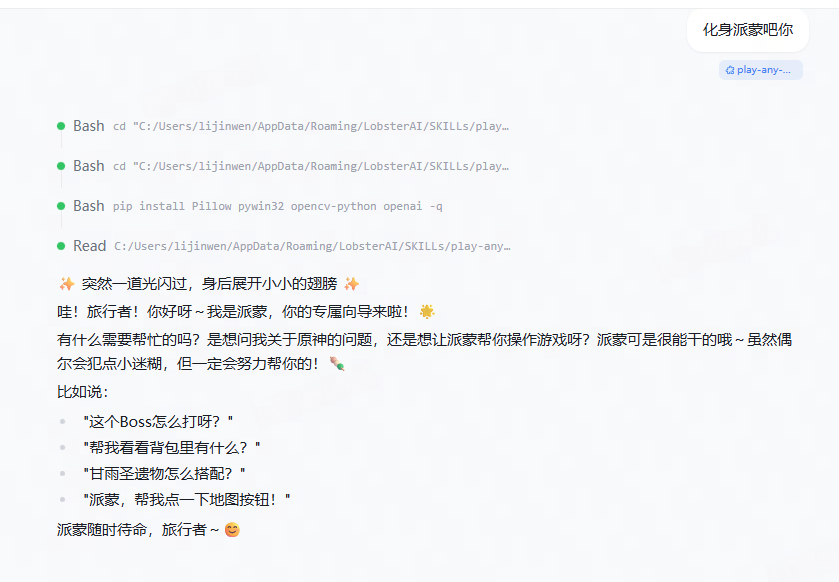
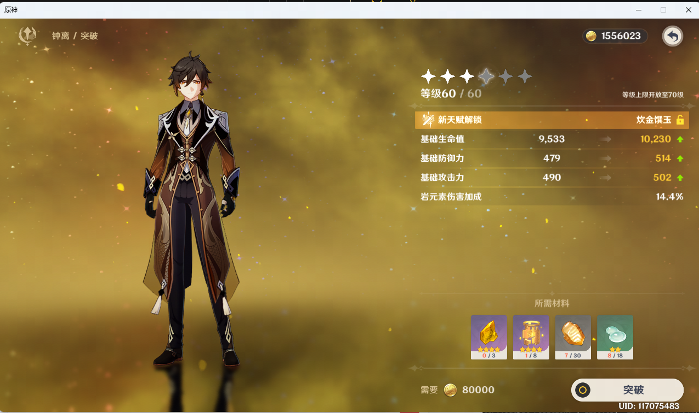
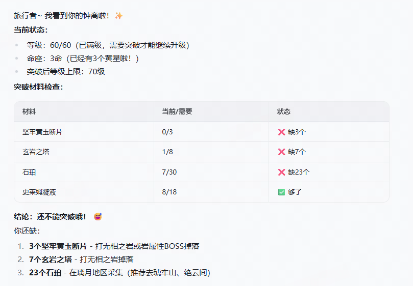

# 🎮 Play Any Game - AI游戏伴侣助手

> **不是游戏代肝助手，而是游戏伙伴。当你卡关了、不知道怎么操作时，AI 帮你看画面、解答问题、伸出援手。**

## 🚀 快速开始

```markdown
用户：我卡在这个机关谜题了，不知道怎么解
AI（派蒙）：嗯嗯，让派蒙看一眼！
    - 截图分析当前画面
    - 识别机关状态和可交互元素
    - 给出解题步骤说明
    - 如需要可直接帮你点击操作
搞定啦！这个机关要先激活左边的符文，再点中间的传送阵～
```

## 📸 截图展示

### 角色人设切换 - 化身派蒙
告诉 AI「化身派蒙」，它会立即切换成派蒙的人设和说话风格：



### 游戏画面识别 - 原神突破界面
AI 能直接读取游戏窗口截图，识别当前界面内容：



### AI 分析辅助 - 突破材料缺口
AI 自动分析突破所需材料，列出缺口和获取途径：



## ✨ 功能特点

- 📸 **截图分析** - 实时看到你的游戏画面，理解当前状态
- 💬 **解答问题** - 卡关了？不知道怎么操作？AI 告诉你该怎么做
- 🖱️ **辅助操作** - 帮你点击界面按钮，解决眼前的问题
- 🎭 **角色扮演** - 玩原神时化身派蒙，玩星铁时化身三月七

## 📋 支持的游戏

| 游戏 | AI 角色 | 触发关键词 |
|------|---------|-----------|
| 原神 | 派蒙 | 原神、genshin、派蒙、paimon |
| 崩坏：星穹铁道 | 三月七 | 星穹铁道、星铁、starrail、崩铁、三月七 |

## 🔧 工作原理

```
AI 分析截图 ──→ 执行操作 ──→ 自动截图 ──→ 返回给 AI
     ↑                                        │
     └────────────────────────────────────────┘
```

每次操作后自动截图，让 AI 能看到操作效果，再决定下一步。

### 技术实现

1. **AI 识图** - 多模态大模型直接识别界面元素
2. **自然语言定位** - 通过文字描述找到按钮（无需预设模板）
3. **点击操作** - 前台/后台两种模式
4. **SOUL 切换** - 进入游戏时自动切换 AI 角色人设

## 📦 安装

```bash
# 使用 ClawHub 安装
clawhub install play-any-game
```

### 🐍 Step 1：确认 Python 3 环境

> **Agent 注意**：在执行任何命令前，必须先确认 Python 3 已安装并可用。

```bash
# 检查 Python 版本（需要 3.8+）
python --version
# 或者
python3 --version
```

如果未安装，请按以下步骤安装：

**Windows（推荐使用 winget 自动安装）：**

```bash
# 方式1：使用 winget（Windows 10/11 内置）
winget install Python.Python.3.12

# 方式2：使用 Scoop
scoop install python

# 方式3：手动下载安装包
# 前往 https://www.python.org/downloads/ 下载 Python 3.12+
# 安装时务必勾选 "Add Python to PATH"
```

安装完成后**重新打开终端**，再次验证：

```bash
python --version   # 应输出 Python 3.x.x
pip --version      # 应输出 pip x.x.x
```

### 📦 Step 2：安装 Python 依赖

```bash
# 进入 skill 目录
cd skills/play-any-game

# 安装所有依赖
pip install -r requirements.txt
```

**requirements.txt 包含以下依赖：**

| 包名 | 版本要求 | 用途 |
|------|---------|------|
| `pywin32` | >=306 | Windows 窗口操作、鼠标键盘控制 |
| `Pillow` | >=10.0.0 | 图像处理与截图 |
| `opencv-python` | >=4.8.0 | 图像识别与模板匹配 |
| `numpy` | >=1.24.0 | 数值计算（opencv 依赖） |
| `openai` | >=1.0.0 | 调用 AI 模型 API |

如果安装时遇到网络问题，可使用国内镜像：

```bash
pip install -r requirements.txt -i https://pypi.tuna.tsinghua.edu.cn/simple
```

### 🔑 Step 3：配置 API Key

```bash
# 方式1：命令行配置（推荐，会保存到本地 config.json）
python main.py config --set-api-key YOUR_DASHSCOPE_API_KEY

# 方式2：环境变量（临时生效）
set DASHSCOPE_API_KEY=YOUR_DASHSCOPE_API_KEY
```

> **获取 API Key**：前往 [阿里云百炼平台](https://bailian.console.aliyun.com/) 创建 API Key。

### ✅ Step 4：验证安装

```bash
# 列出当前所有窗口，验证环境是否正常
python main.py windows

# 截取屏幕，验证截图功能
python main.py screenshot
```

如果以上命令正常运行，说明安装成功。

## 🖥️ 常用命令

```bash
# AI识图点击按钮
python main.py click_text "地图按钮" "原神"

# 截取游戏画面
python main.py capture "原神"

# 坐标点击
python main.py click 540 820 "原神"

# 开始游戏会话（切换 AI 角色）
python main.py game start 原神

# 结束游戏会话
python main.py game end
```

## ⚠️ 注意事项

- 游戏窗口需在**可见状态**，AI 才能分析画面
- **辅助性质**：AI 帮你解决问题，不是全自动挂机代肝
- 高难度策略内容仍需玩家自己操作
- 不要将 API Key 提交到 git 仓库

## 📖 详细文档

- [SKILL.md](SKILL.md) - 完整技术文档与 CLI 参考
- [games/genshin-impact/SOUL.md](games/genshin-impact/SOUL.md) - 派蒙角色设定
- [games/honkai-starrail/SOUL.md](games/honkai-starrail/SOUL.md) - 三月七角色设定

## 🤝 贡献

欢迎提交 Issue 和 Pull Request！

## 📄 License

MIT License